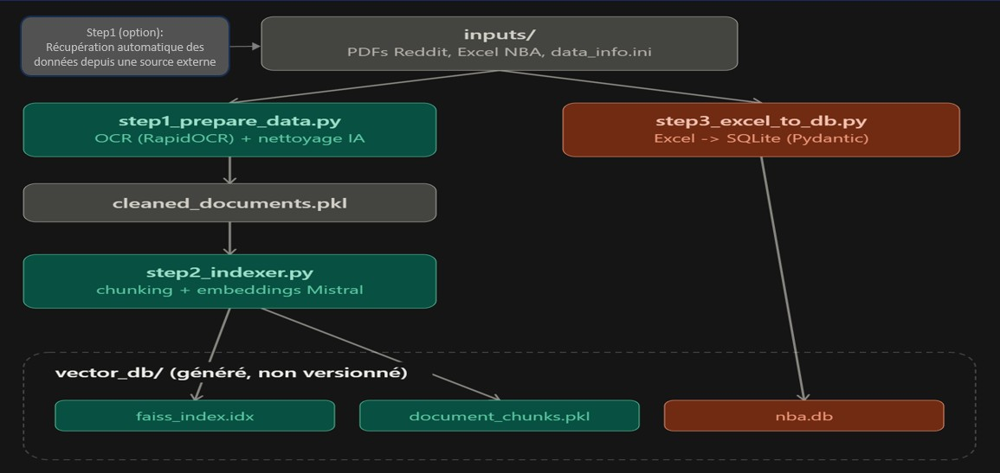
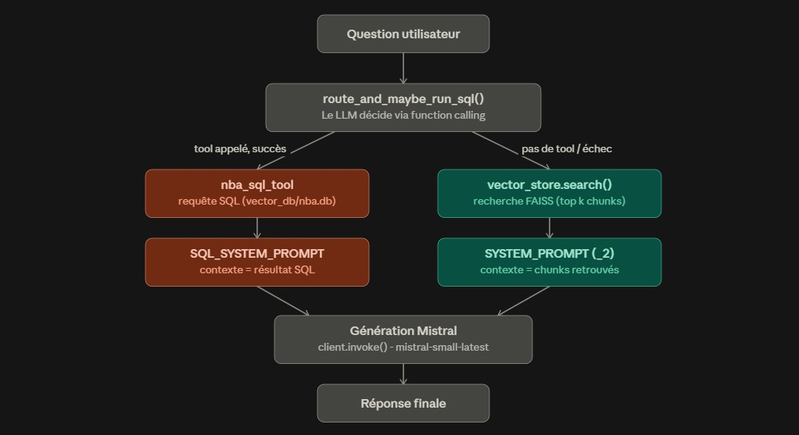

# Assistant RAG NBA — SportSee

Assistant virtuel basé sur Mistral AI, combinant **RAG** (Retrieval-Augmented
Generation) sur des archives textuelles NBA (discussions Reddit) et un
**outil SQL** interrogeant une base de statistiques NBA, pour répondre aussi
bien aux questions qualitatives qu'aux questions chiffrées.

## Fonctionnalités

- 🔍 **Recherche sémantique** avec FAISS (index `IndexFlatIP`, similarité cosinus)
- 🔢 **Requêtage SQL** sur une base de statistiques NBA (SQLite), pour les
  questions chiffrées — le LLM décide automatiquement (function calling)
  s'il doit passer par le Tool SQL ou par le RAG classique
- 📄 **Ingestion des documents texte** : PDF (avec OCR automatique via
  **RapidOCR** pour les documents scannés), DOCX, TXT, suivie d'un
  **nettoyage par agent Pydantic AI** (Mistral) pour retirer le bruit
  (publicités, fins de page, etc.)
- 📊 **Ingestion des statistiques** : chargement du fichier Excel NBA dans
  une base SQLite, avec validation Pydantic ligne par ligne avant insertion
- 🤖 **Génération de réponses** avec les modèles Mistral (`mistral-small-latest`
  par défaut) via LangChain
- 📈 **Observabilité** avec Pydantic Logfire (traces sur le routage SQL/RAG,
  le retrieval et la génération)
- ✅ **Évaluation RAGAS** du pipeline complet (routage SQL + RAG), avec
  scores détaillés par catégorie de question et par route empruntée
- 💬 **Interface conversationnelle** via Streamlit

## Prérequis

- Python 3.10+
- Clé API Mistral (obtenue sur [console.mistral.ai](https://console.mistral.ai/))
- Un compte Logfire (gratuit) pour l'observabilité — voir configuration ci-dessous

## Installation

1. **Cloner le dépôt**

```bash
git clone https://github.com/jackobess/OC_Projet10.git
cd OC_Projet10
```

2. **Créer et activer un environnement virtuel**

```bash
python -m venv venv

# Windows
venv\Scripts\activate

# macOS/Linux
source venv/bin/activate
```

3. **Installer les dépendances**

```bash
pip install -r requirements.txt
```

4. **Configurer la clé API Mistral**

Créer un fichier `.env` à la racine du projet :

```
MISTRAL_API_KEY=votre_clé_api_mistral
```

C'est la seule variable sensible attendue dans `.env`. Le reste de la
configuration (modèles utilisés, taille des chunks, chemins des fichiers...)
est centralisé dans `utils/config.py`.

5. **Authentifier Logfire (une seule fois)**

```bash
logfire auth
```

Les identifiants sont stockés localement dans `.logfire/` (créé
automatiquement, non versionné) — rien à ajouter dans `.env`.

## Structure du projet

```
.
├── docs/*.*                     # Documentation du projet
├── inputs/                      # Documents sources
│   ├── Reddit 1.pdf … Reddit 4.pdf
│   ├── regular NBA.xlsx         # Statistiques NBA (saison courante)
│   └── data_info.ini            # Métadonnées à injecter (ex: saison)
├── ragas_data/
│   ├── ragas_dataset.py         # Jeu de questions/réponses de référence pour RAGAS
│   └── ragas_results.xlsx       # Résultats détaillés de la dernière évaluation
├── utils/
│   ├── config.py                # Configuration centrale de l'application
│   ├── data_loader.py           # Extraction de texte (PDF/OCR, DOCX, TXT)
│   ├── cleaner.py               # Nettoyage des documents (agent Pydantic AI / Mistral)
│   ├── vector_store.py          # Gestion de l'index FAISS et recherche sémantique
│   ├── sql_tool.py              # Outil LangChain de requêtage SQL (nba_sql_tool)
│   ├── prompts.py               # Prompts système (RAG, SQL)
│   └── schemas.py               # Modèles Pydantic partagés
├── vector_db/                   # Généré, non versionné (régénérable via les steps)
│   ├── cleaned_documents.pkl    # Sortie step1 / entrée step2
│   ├── faiss_index.idx          # Index vectoriel FAISS
│   ├── document_chunks.pkl      # Chunks associés à l'index
│   └── nba.db                   # Base SQLite des statistiques (sql_tool)
├── step1_prepare_data.py        # Extraction + nettoyage des documents texte
├── step2_indexer.py             # Chunking + embeddings + index FAISS
├── step3_excel_to_db.py         # Chargement des statistiques Excel -> SQLite
├── run_all_steps.py             # Enchaîne step1 -> step2 -> step3
├── evaluate_ragas.py            # Évaluation RAGAS du pipeline complet
├── read_chunks.py               # Utilitaire de debug : inspecter document_chunks.pkl
├── MistralChat.py               # Application Streamlit (agent RAG + SQL)
├── requirements.txt
├── .env                         # Clé API Mistral (non versionné)
├── .gitignore
└── README.md
```

## Utilisation

### 1. Ajouter des documents

- Threads Reddit (PDF, y compris scannés) → dossier `inputs/`. L'OCR
  (**RapidOCR**) se déclenche automatiquement sur les PDF peu ou pas
  extractibles, sans action manuelle.
- Statistiques NBA → `inputs/regular NBA.xlsx` (feuilles "Données NBA" et
  "Equipe").
- Saison de référence des statistiques → renseignée dans `inputs/data_info.ini`
  (section `[sources_info]`, clé `saison`), utilisée par défaut par
  `step3_excel_to_db.py`, `evaluate_ragas.py` et `MistralChat.py` si l'option
  `--season` n'est pas fournie.

### 2. Préparer et indexer les données

Le pipeline de préparation est découpé en trois scripts indépendants,
chacun relançable séparément :

```bash
python step1_prepare_data.py   # extraction + nettoyage -> vector_db/cleaned_documents.pkl
python step2_indexer.py        # chunking + embeddings -> vector_db/faiss_index.idx + document_chunks.pkl
python step3_excel_to_db.py    # Excel -> vector_db/nba.db (indépendant des 2 précédents)
```

Ou en une seule commande :

```bash
python run_all_steps.py [--data-url URL]
```

- **`step1_prepare_data.py`** : charge et parse les fichiers texte de
  `inputs/` (PDF/DOCX/TXT, avec OCR RapidOCR si besoin), enrichit leurs
  métadonnées avec `data_info.ini`, puis nettoie chaque document via un
  agent Pydantic AI (Mistral) pour retirer le bruit. Sauvegarde le résultat
  dans `vector_db/cleaned_documents.pkl`.
- **`step2_indexer.py`** : recharge `cleaned_documents.pkl`, découpe en
  chunks, génère les embeddings via l'API Mistral (`mistral-embed`) et
  construit l'index FAISS (`vector_db/faiss_index.idx` +
  `vector_db/document_chunks.pkl`). Peut être relancé seul après toute
  modification de `cleaned_documents.pkl`.
- **`step3_excel_to_db.py`** : indépendant des deux premiers, peut être
  relancé seul. Charge `regular NBA.xlsx` dans `vector_db/nba.db`, avec
  validation Pydantic ligne par ligne (`PlayerStatRow`/`TeamRow`) — les
  lignes invalides sont rejetées et journalisées, pas silencieusement
  ignorées. Un relancement pour une saison donnée supprime puis recharge
  les statistiques de cette saison (pas d'upsert).

> `vector_db/` n'est pas versionné dans Git : il est entièrement
> régénérable à partir de `inputs/` via ces scripts.

### 3. Lancer l'application

```bash
streamlit run MistralChat.py -- --season 2024-25
```

(`--season` optionnel si `inputs/data_info.ini` renseigne déjà la saison)

Application accessible sur http://localhost:8501.

Chaque question est routée automatiquement par le LLM (function calling
LangChain/Mistral) : les questions chiffrées déclenchent l'outil SQL
(`nba_sql_tool`, interrogation de `vector_db/nba.db`), les autres passent
par le RAG classique (recherche FAISS). En cas d'échec du Tool SQL, la
question retombe automatiquement sur le RAG. Le routage, le retrieval et
la génération sont tracés via Pydantic Logfire.

### 4. Évaluer le système avec RAGAS

```bash
python evaluate_ragas.py [--season 2024-25] [--output ragas_data/ragas_results.xlsx]
```

Réplique exactement la logique de routage SQL/RAG de `MistralChat.py` sur
le jeu de questions de `ragas_data/ragas_dataset.py`, puis calcule les
métriques `faithfulness`, `answer_relevancy`, `context_precision`,
`context_recall` et `answer_correctness` (juge : Mistral, pas OpenAI).
Exporte les résultats détaillés en `.xlsx`, avec la route empruntée par
question (`sql` / `rag`), et affiche les moyennes globales, par catégorie
et par route.

> Les métriques `context_precision`/`context_recall` sont conçues pour du
> texte récupéré par similarité vectorielle : sur la route SQL, le
> "contexte" est le résultat brut de la requête, ces deux métriques y sont
> donc moins interprétables. Privilégier `faithfulness`/`answer_correctness`
> pour lire les résultats de la route SQL.

### 5. Débugger l'index (optionnel)

```bash
python read_chunks.py                 # résumé : nombre de chunks, répartition par source
python read_chunks.py 42               # affiche le contenu complet du chunk n°42
python read_chunks.py "Jokic"           # liste les chunks contenant cette chaîne (insensible à la casse)
python read_chunks.py -s 42            # force la recherche même si l'argument est un nombre
```

Petit utilitaire de debug pour inspecter `vector_db/document_chunks.pkl`
sans repasser par le RAG : utile pour vérifier qu'un chunk contient bien
l'information attendue, ou pour retrouver rapidement dans quel(s) chunk(s)
un mot ou un nom apparaît.

## Modules principaux

### `utils/data_loader.py`
Extraction de texte des documents PDF/DOCX/TXT, avec fallback OCR
(**RapidOCR**) automatique pour les PDF scannés ou peu extractibles.

### `utils/cleaner.py`
Nettoyage des documents extraits via un agent **Pydantic AI** branché sur
Mistral : suppression du bruit (publicités, fins de page, etc.) avant
indexation.

### `utils/vector_store.py`
Gère l'index vectoriel FAISS : découpage des documents en chunks,
génération des embeddings via l'API Mistral, création/chargement de
l'index, recherche par similarité cosinus.

### `utils/sql_tool.py`
Outil LangChain (`nba_sql_tool`) exposé au LLM par function calling :
génère et exécute une requête SQL (garde-fou SELECT uniquement) sur
`vector_db/nba.db` pour répondre aux questions statistiques. Expose
également `set_season`/`has_season_data` pour scoper les requêtes à la
saison courante.

### `utils/prompts.py`
Centralise les prompts système de l'application (RAG, RAG sans repli
hors-contexte, réponse SQL).

### `utils/schemas.py`
Modèles Pydantic partagés (documents, métadonnées) utilisés par le
pipeline de préparation des données.

### `utils/config.py`
Centralise la configuration de l'application (modèles Mistral, taille des
chunks, chemins des fichiers, paramètres de recherche).

## Personnalisation

Les paramètres suivants sont modifiables dans `utils/config.py` :
- Modèles Mistral utilisés (génération / embedding)
- Taille des chunks et chevauchement (`CHUNK_SIZE`, `CHUNK_OVERLAP`)
- Nombre de documents récupérés par recherche (`SEARCH_K`)
- Chemins des fichiers (`INPUT_DIR`, `VECTOR_DB_DIR`, `DB_FILE`, `XLS_FILE`,
  `DATA_INFO_FILE`, `DOCUMENT_CHUNKS_FILE`)
- Titre de l'application et nom du domaine (`APP_TITLE`, `NAME`)

## Schema du pipeline de preparation


## FlowChart du process de l'agent IA


